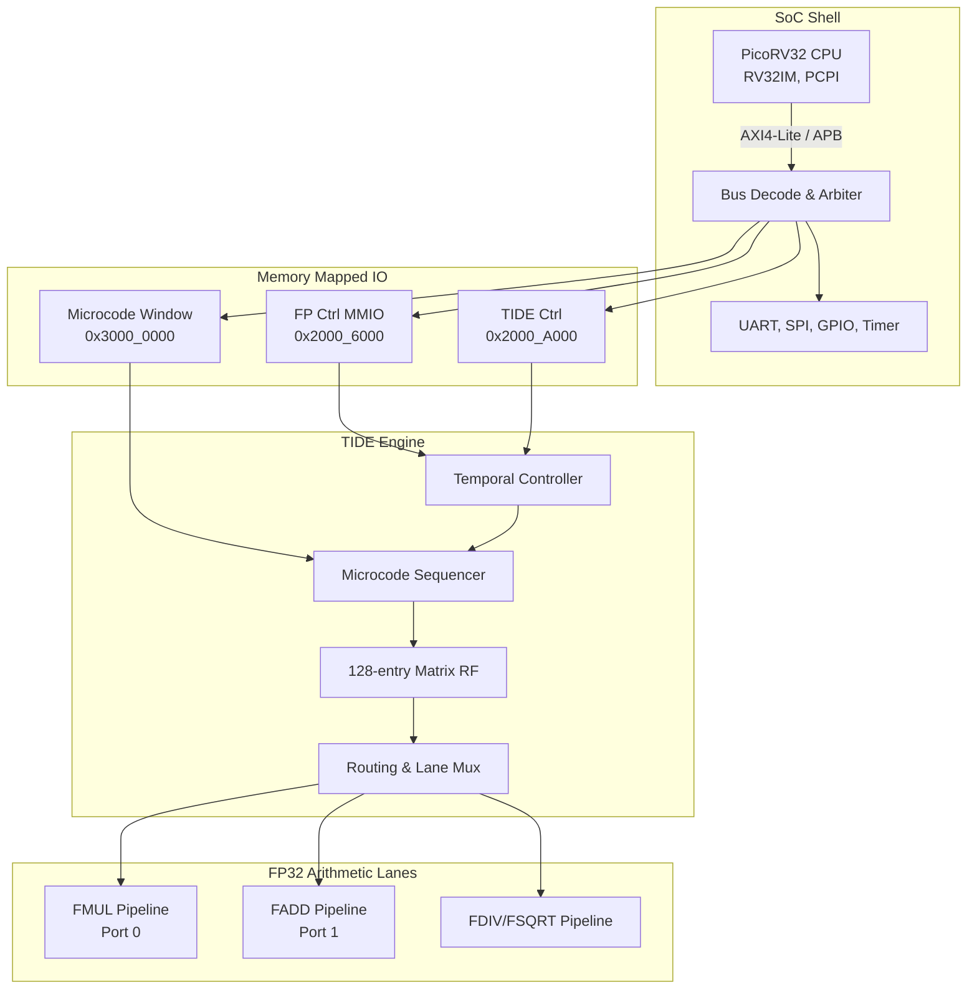

# TIDE-EKF SoC: Microcoded Radar-Inertial Estimator

## Overview

ICE_SoC is a highly specialized RISC-V System-on-Chip (SoC) designed specifically for hard real-time radar-inertial georeferencing workloads. Built around a PicoRV32 RV32IM core, the SoC is augmented with a tightly coupled, dedicated **TIDE (Temporal Inference & Data Engine)** coprocessor. The TIDE engine offloads complex Extended Kalman Filter (EKF) matrix mathematics from the general-purpose CPU, executing them deterministically on a custom 96-bit Very Long Instruction Word (VLIW) microcode architecture.

The entire SoC is designed to synthesize for a 50 MHz target clock and features comprehensive memory-mapped I/O to facilitate high-bandwidth telemetry and control.

## Architecture & Integration

The TIDE engine operates as an independent coprocessor with its own local memory subsystem. It leverages a custom microcoded sequencer to dispatch concurrent arithmetic and memory operations every clock cycle.

### System Block Diagram

## TIDE Engine Subsystems

The coprocessor is divided into several highly optimized domains designed to maximize throughput for dense matrix operations.

### 96-bit VLIW Microcode Execution
The core of the engine is a 96-bit VLIW sequencer featuring 5 concurrent execution slots: Multiplier, Adder, DivSqrt, Load/Store/ALU, and Control. This allows the engine to simultaneously fetch memory, compute floating-point additions, and multiply state matrices in a single deterministic clock cycle. Zero-overhead hardware looping is supported via a dedicated hardware loop counter, avoiding instruction pipeline bubbles during dense matrix iterations.

### FP32 Hardware Pipelines
Standard RISC-V floating-point extensions are insufficient for the deterministic throughput required by the radar EKF. Instead, TIDE implements custom, fully IEEE-754 compliant FP32 data lanes. The Multiplier (Port 0) and Adder (Port 1) are physically segregated to ensure collision-free operand routing from the Register File. The complex DivSqrt unit shares routing with the LSU to compress the VLIW instruction width, explicitly routing its destination dynamically.

### Matrix Register File & Memory
The engine features a dedicated 128-word multi-ported Register File designed explicitly for EKF state vectors, covariance matrices, and measurement residuals. It supports 4 simultaneous read ports and 3 simultaneous write ports to feed the FP32 pipelines without stalling. Bulk state data is stored in a partitioned 4 KB TIDE-RAM, while the execution logic is stored in a localized 512-word Microcode RAM to prevent instruction fetch contention on the main AXI bus.

### Temporal Controller
To handle the chaotic nature of real-world drone telemetry, the engine includes a specialized Temporal Controller. This unit is engineered to manage late, out-of-sequence radar measurements by transparently buffering hardware checkpoints. If a delayed telemetry packet arrives at the SoC, the Temporal Controller can rewind the filter state and replay the measurement without forcing the PicoRV32 core to execute expensive context switches.

## Current Project Status

The project is currently in active development, with significant portions of the architecture and arithmetic logic structurally complete and heavily verified:

- **Architecture & Specification:** The baseline architecture, instruction behaviors, and module interconnect topologies are thoroughly defined. Final reviews are underway to resolve minor hardware contract ambiguities before full SoC integration.
- **Module Implementation:** The 32-bit floating-point arithmetic pipelines (Adder, Multiplier, DivSqrt, and Int-ALU) have been fully implemented and exhaustively unit-tested against the Berkeley SoftFloat reference implementation. Development is currently focused on the remaining core modules, specifically the VLIW Sequencer logic and the AXI4-Lite interconnect bridges.
- **Verification Infrastructure:** A robust verification methodology utilizing a Python/SVA (SystemVerilog Assertions) testbench has been successfully established. It features a mutation-testing framework capable of validating cycle-accurate mock RTL. 
- **Next Steps:** Once the Sequencer and Memory control blocks are completed, the project will move into the final integration phase. The verified arithmetic RTL modules will be wired into the established verification harness for comprehensive system-level sign-off.
